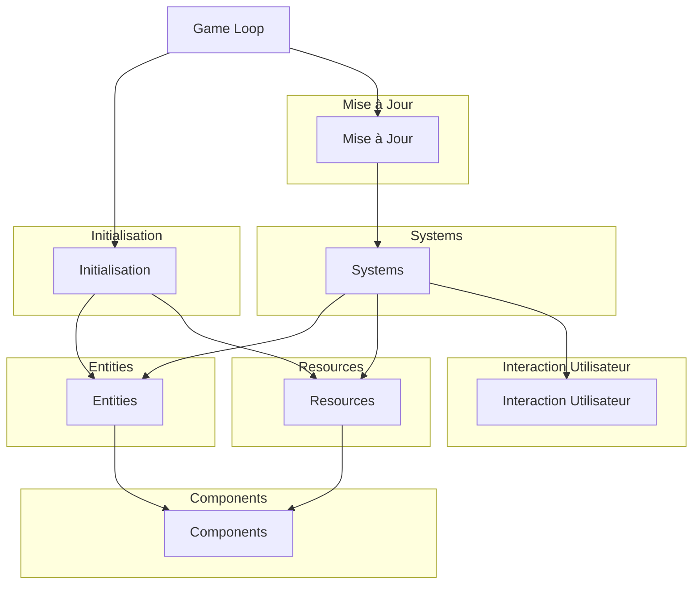

# Architecture Decision Record (ADR) Robot avec Bevy

## Contexte

Pour notre projet de dév de jeu, nous avions plusieurs options de moteurs de jeu à utiliser. Les moteurs envisagés incluaient Bevy, ggez et autres.

## Décision

Nous avons décidé d'utiliser Bevy au début comme moteur de jeu principal pour notre projet.

## Alternatives Considérées

1. **ggez**
   - **Avantages** :
     - Facile à apprendre et à utiliser.
     - Bonne documentation et communauté active.
     - Rapide a metttre en place pour des jeux simples.
   - **Inconvénients** :
     - Moins flexible et moins performant pour des jeux plus complexes.

2. **Bevy**
   - **Avantages** :
     -  ECS, qui offre une meilleure performance et une architecture plus flexible.
     - Fortement intégré avec Rust, permettant de tirer parti des caractéristiques du langage.
   - **Inconvénients** :
     - Courbe d'apprentissage plus abrupte.
     - Plus de bugs et de défis tech à résoudre.

## Conséquences

1. **Courbe d'apprentissage** :
   - Nous avons passer plus de temps à apprendre et maîtriser Bevy que de considérer des alternatives comme ggez. Cela a entraîné des délais supplementaire dans le dev .

2. **Défis techniques** :
   - Nous avons souvent rencontré des bugs lors du lancement du jeu, en particulier lors de l'ajout de nouvelles fonctionnalités comme l'effet de brouillard, nous avons fait face à des erreurs difficiles à déboguer.
   - Les conflits et les problemes tech dans la gestion des composants ont limité notre capacité à ajouter certaines fonctionnalités.

3. **Collaboration et apprentissage** :
   Chaque membre de l'équipe de développer une compréhension approfondie des moteurs de jeu modernes et de la programmation en Rust.

## Conclusion

Le choix d'utiliser Bevy, bien que plus complexe et exigeeant. Il nous a permis de développer nos compétences en Rust. Ce choix montre notre découvrir des technologies avancées et à relever des défis techniques lors de nos cours à l'EFREI.

## Diagramme ADR

## Explication du Diagramme

1. **Game Loop** :
   - La boucle de jeu initialise et met à jour les différents systèmes du jeu.

2. **Initialisation** :
   - Lors de l'initialisation, les entités et les ressources sont créées.

3. **Entities** :
   - Les entites sont les objets du jeu, comme les robots, les arbres, les stars et les minerais.

4. **Components** :
   - Les composants définissent les données associées aux entités, telles que les transformations, les sprites..

5. **Resources** :
   - Les ressources sont des données partagées et globales, comme les scores et les minuteries

6. **Systems** :
   - Les systèmes gèrent les comportements du jeu, comme le mouvement des robots, la détection des collisions, la mise à jour des score sur le terminal

7. **Interaction Utilisateur** :
   - Les entrées de l'utilisateur (clavier, souris) sont traitées par des systèmes spécifiques et influencent les comportements du jeuu
